hw05\_gapminder
================
Seevasant Indran  
19 October, 2018  

<details>
  <summary>
Table of contents
  </summary>  
   
-   [Part 1: Factor management.](#part-1-factor-management.)
    -   [Factor exploration](#factor-exploration)
    -   [Levels in the country and continent factor variables](#levels-in-the-country-and-continent-factor-variables)
    -   [`droplevels`, drop Oceania and remove unused factor levels](#droplevels-drop-oceania-and-remove-unused-factor-levels)
    -   [Just my two cents](#just-my-two-cents)
        -   [`Forcats::fct_reorder` -&gt; reorder levels](#forcatsfct_reorder---reorder-levels)
    -   [Usage `fct_reorder`](#usage-fct_reorder)
        -   [look if at the dataframe if the factors aree re-ordered.](#look-if-at-the-dataframe-if-the-factors-aree-re-ordered.)
        -   [Top 5 mean life expectancies](#top-5-mean-life-expectancies)
        -   [five countries with the highest life expectancy in 2007.](#five-countries-with-the-highest-life-expectancy-in-2007.)
-   [Part 2: File I/O](#part-2-file-io)
    -   [`write.csv` and `read.csv`](#write.csv-and-read.csv)
-   [Part 3: Visualization design](#part-3-visualization-design)
    -   [`gganimate`](#gganimate)
    -   [plotly plots](#plotly-plots)
-   [Part 4: Writing figures to file](#part-4-writing-figures-to-file)
    -   [`ggsave()` the day](#ggsave-the-day)
-   [But I want to do more](#but-i-want-to-do-more)

<details open> <summary> Packages required </summary>

-   [tidyverse](http://tidyverse.tidyverse.org/) (includes [ggplot2](http://ggplot2.tidyverse.org/), [dplyr](http://dplyr.tidyverse.org/), [tidyr](http://tidyr.tidyverse.org/), [readr](http://readr.tidyverse.org/), [tibble](http://tibble.tidyverse.org/))
-   [gapminder](https://cran.r-project.org/web/packages/gapminder/index.html)
-   [knitr](https://cran.r-project.org/web/packages/knitr/index.html)
-   [gganimate](https://github.com/thomasp85/gganimate)
-   [transformr](https://github.com/thomasp85/transformr)
-   [maps](https://cran.r-project.org/web/packages/maps/index.html)
-   [devtools](https://cran.r-project.org/web/packages/devtools/index.html)
-   [plotly](https://cran.r-project.org/web/packages/plotly/index.html)
-   [forcats](https://cran.r-project.org/web/packages/forcats/index.html)
-   [gridextra](https://cran.r-project.org/web/packages/gridExtra/index.html)  

</details>    
   
**Install by running**  

    install.packages("packageName", dependencies = TRUE)

</details>

Part 1: Factor management.
==========================

Previously we emphasized on the gapminder dataset without really looking very deeply into factors and managing factors. We will emphasize mainly on factrors in Part 1 and look at how these factors interact with out dataset.

### Factor exploration

``` r
## `dplyr::glimpse` is a little like str() applied to a data frame but it tries to show you as much data as possible.
glimpse(gapminder)
```

    ## Observations: 1,704
    ## Variables: 6
    ## $ country   <fct> Afghanistan, Afghanistan, Afghanistan, Afghanistan, ...
    ## $ continent <fct> Asia, Asia, Asia, Asia, Asia, Asia, Asia, Asia, Asia...
    ## $ year      <int> 1952, 1957, 1962, 1967, 1972, 1977, 1982, 1987, 1992...
    ## $ lifeExp   <dbl> 28.801, 30.332, 31.997, 34.020, 36.088, 38.438, 39.8...
    ## $ pop       <int> 8425333, 9240934, 10267083, 11537966, 13079460, 1488...
    ## $ gdpPercap <dbl> 779.4453, 820.8530, 853.1007, 836.1971, 739.9811, 78...

There are 1704 observations with 6 variable. Out of the 6, the `country` and the `continent` is a factor variable. Altenatively, `is.factor()` returns a logical.

``` r
## count the number of levels on each variable on the gapminder dataset.
sapply(gapminder, nlevels) #sapply appliea the nlevels onto all variable on the gapminder dataset and returns the frequemncy of levels.
```

    ##   country continent      year   lifeExp       pop gdpPercap 
    ##       142         5         0         0         0         0

There are 142 levels in the `gapminder` country column and there are 5 levels in the `gapminder` continent column. The `year`, `lifeExp`, `pop`, and `gdpPercap` has no value because `nlevels` returns only the number of levels in a factor columns. The `country` and `continent` variables are the only factor variables in the `gapminder dataset. This doesnt however list out all the levels, that is because levels under the hood is actually an integer. For that we can try the`for\` loop.

### Levels in the country and continent factor variables

``` r
## Use `for` loop to check for factors and list out all the levels under that factor variable.
for (item in names(gapminder)) # for each item in the names(gapminder)
  if (is.factor(gapminder[[item]])) { 
    print (item) # check if its a factor and print the factor variables
    print(levels(gapminder[[item]])) # then print the levels under those factor variables
  }
```

    ## [1] "country"
    ##   [1] "Afghanistan"              "Albania"                 
    ##   [3] "Algeria"                  "Angola"                  
    ##   [5] "Argentina"                "Australia"               
    ##   [7] "Austria"                  "Bahrain"                 
    ##   [9] "Bangladesh"               "Belgium"                 
    ##  [11] "Benin"                    "Bolivia"                 
    ##  [13] "Bosnia and Herzegovina"   "Botswana"                
    ##  [15] "Brazil"                   "Bulgaria"                
    ##  [17] "Burkina Faso"             "Burundi"                 
    ##  [19] "Cambodia"                 "Cameroon"                
    ##  [21] "Canada"                   "Central African Republic"
    ##  [23] "Chad"                     "Chile"                   
    ##  [25] "China"                    "Colombia"                
    ##  [27] "Comoros"                  "Congo, Dem. Rep."        
    ##  [29] "Congo, Rep."              "Costa Rica"              
    ##  [31] "Cote d'Ivoire"            "Croatia"                 
    ##  [33] "Cuba"                     "Czech Republic"          
    ##  [35] "Denmark"                  "Djibouti"                
    ##  [37] "Dominican Republic"       "Ecuador"                 
    ##  [39] "Egypt"                    "El Salvador"             
    ##  [41] "Equatorial Guinea"        "Eritrea"                 
    ##  [43] "Ethiopia"                 "Finland"                 
    ##  [45] "France"                   "Gabon"                   
    ##  [47] "Gambia"                   "Germany"                 
    ##  [49] "Ghana"                    "Greece"                  
    ##  [51] "Guatemala"                "Guinea"                  
    ##  [53] "Guinea-Bissau"            "Haiti"                   
    ##  [55] "Honduras"                 "Hong Kong, China"        
    ##  [57] "Hungary"                  "Iceland"                 
    ##  [59] "India"                    "Indonesia"               
    ##  [61] "Iran"                     "Iraq"                    
    ##  [63] "Ireland"                  "Israel"                  
    ##  [65] "Italy"                    "Jamaica"                 
    ##  [67] "Japan"                    "Jordan"                  
    ##  [69] "Kenya"                    "Korea, Dem. Rep."        
    ##  [71] "Korea, Rep."              "Kuwait"                  
    ##  [73] "Lebanon"                  "Lesotho"                 
    ##  [75] "Liberia"                  "Libya"                   
    ##  [77] "Madagascar"               "Malawi"                  
    ##  [79] "Malaysia"                 "Mali"                    
    ##  [81] "Mauritania"               "Mauritius"               
    ##  [83] "Mexico"                   "Mongolia"                
    ##  [85] "Montenegro"               "Morocco"                 
    ##  [87] "Mozambique"               "Myanmar"                 
    ##  [89] "Namibia"                  "Nepal"                   
    ##  [91] "Netherlands"              "New Zealand"             
    ##  [93] "Nicaragua"                "Niger"                   
    ##  [95] "Nigeria"                  "Norway"                  
    ##  [97] "Oman"                     "Pakistan"                
    ##  [99] "Panama"                   "Paraguay"                
    ## [101] "Peru"                     "Philippines"             
    ## [103] "Poland"                   "Portugal"                
    ## [105] "Puerto Rico"              "Reunion"                 
    ## [107] "Romania"                  "Rwanda"                  
    ## [109] "Sao Tome and Principe"    "Saudi Arabia"            
    ## [111] "Senegal"                  "Serbia"                  
    ## [113] "Sierra Leone"             "Singapore"               
    ## [115] "Slovak Republic"          "Slovenia"                
    ## [117] "Somalia"                  "South Africa"            
    ## [119] "Spain"                    "Sri Lanka"               
    ## [121] "Sudan"                    "Swaziland"               
    ## [123] "Sweden"                   "Switzerland"             
    ## [125] "Syria"                    "Taiwan"                  
    ## [127] "Tanzania"                 "Thailand"                
    ## [129] "Togo"                     "Trinidad and Tobago"     
    ## [131] "Tunisia"                  "Turkey"                  
    ## [133] "Uganda"                   "United Kingdom"          
    ## [135] "United States"            "Uruguay"                 
    ## [137] "Venezuela"                "Vietnam"                 
    ## [139] "West Bank and Gaza"       "Yemen, Rep."             
    ## [141] "Zambia"                   "Zimbabwe"                
    ## [1] "continent"
    ## [1] "Africa"   "Americas" "Asia"     "Europe"   "Oceania"

It looks like all the levels are ordered in an alphabetical order which doesnt make any sense or is it usefull, if your sending a official govement survey from the world to Uganda goverment then maybe you want to reorder Uganda to the top. Other than that, it is preety much holds unvaluable information in terms of ordering.

### `droplevels`, drop Oceania and remove unused factor levels

> With the data set of your choice, after ensuring the variable(s) you’re exploring are indeed factors, you are expected to: 1. Drop factor / levels; 2. Reorder levels based on knowledge from data.

Use {Base} `R` `droplevels()`. It which operates on an entire data frame or factor, then reorder using `forcats` `fct_recode` to reorder levels.

``` r
## drop Oceania level from continent factor variable
gapminderNoOceania <- gapminder %>%  # Assign modified dataset to gapminderNoOceania
  filter(continent != "Oceania") # filter looks row-wise at continent column and returns NOT(!) Oceania, everything other than Oceania is retained.
```

#### Sanity checks,

``` r
# checks how many times each counties were repeated.
gapminder %>% 
  group_by(country) %>% # Group by country
  count() %>%  # Creates a table with times the country represented in dataset
  pull(n) %>% # Retrive only the n (frequency) column to pipe to the next function 
  unique() # list all unique value, if all countries have 12 rows each, only one unique value which is 12
```

    ## [1] 12

``` r
# check how many country in oceania region
unique(subset(gapminder, continent == "Oceania", select = country)) # subsets continent Ocenia for non repeated country
```

    ## # A tibble: 2 x 1
    ##   country    
    ##   <fct>      
    ## 1 Australia  
    ## 2 New Zealand

``` r
# Dimension before and after filter 
dim(gapminderNoOceania) - dim(gapminder) # equalirty test of dimension of dataset before and after
```

    ## [1] -24   0

``` r
# Checks 

tbl_df(gapminderNoOceania)
```

    ## # A tibble: 1,680 x 6
    ##    country     continent  year lifeExp      pop gdpPercap
    ##    <fct>       <fct>     <int>   <dbl>    <int>     <dbl>
    ##  1 Afghanistan Asia       1952    28.8  8425333      779.
    ##  2 Afghanistan Asia       1957    30.3  9240934      821.
    ##  3 Afghanistan Asia       1962    32.0 10267083      853.
    ##  4 Afghanistan Asia       1967    34.0 11537966      836.
    ##  5 Afghanistan Asia       1972    36.1 13079460      740.
    ##  6 Afghanistan Asia       1977    38.4 14880372      786.
    ##  7 Afghanistan Asia       1982    39.9 12881816      978.
    ##  8 Afghanistan Asia       1987    40.8 13867957      852.
    ##  9 Afghanistan Asia       1992    41.7 16317921      649.
    ## 10 Afghanistan Asia       1997    41.8 22227415      635.
    ## # ... with 1,670 more rows

``` r
nlevels(gapminderNoOceania$country) == nlevels(gapminder$country)
```

    ## [1] TRUE

``` r
nlevels(gapminderNoOceania$continent) == nlevels(gapminder$continent)
```

    ## [1] TRUE

Each country in Oceania is represented 12 times in the dataset (12 data points in years (1952 - 2007)). There two countries from the Oceania region are Australia and New Zealand. The differences from the dimensions of the rows after filtering the datasets should be -24, which is reflected by the sanity checks.

The number of rows reflect the changes of subsetting without Oceania. However, all the levels are still being retained in the country and the continent column.

Just my two cents
-----------------

Although the levels are retained, the information of having them can be useful at times. Consider the short example of it being usefull.

``` r
responses <- factor(c("Agree", "Agree", "Strongly Agree", "Disagree", "Agree"))
responses
```

    ## [1] Agree          Agree          Strongly Agree Disagree      
    ## [5] Agree         
    ## Levels: Agree Disagree Strongly Agree

``` r
responses2<-factor(c("Agree", "Agree", "Strongly Agree", "Disagree", "Agree"),
                  levels=c("Strongly Agree", "Agree", "Disagree", "Strongly Disagree"))
responses2
```

    ## [1] Agree          Agree          Strongly Agree Disagree      
    ## [5] Agree         
    ## Levels: Strongly Agree Agree Disagree Strongly Disagree

``` r
df <- data.frame(responses = responses) #create a data frame for ggplot
df2 <- data.frame(responses = responses2)

p1 <- ggplot(data = df, aes(x = responses)) + geom_bar() + scale_x_discrete(drop = FALSE) 

p2 <- ggplot(data = df2, aes(x = responses)) + geom_bar() + scale_x_discrete(drop = FALSE) 

grid.arrange(p1, p2, # makes a grid of plots so multiple plots can be dislpayed
  ncol = 2, # a plot in a 2 column 1 row format 
  top = "Response to usefulness of STAT545", # tittle for the grid plots
  widths = c(0.4, 0.4), # width for the plots
  clip = FALSE)
```

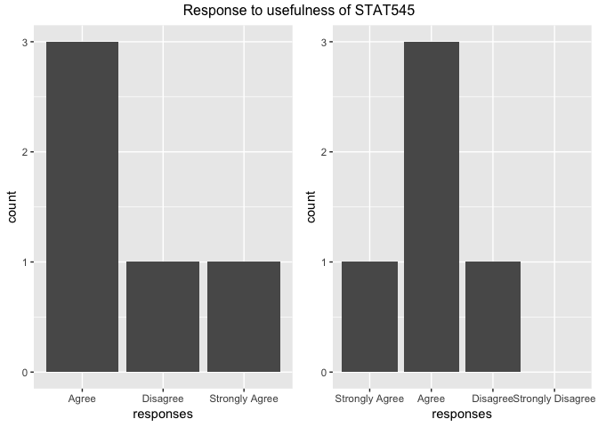

Woudnt you agree that you would like to have the factor level "strongly disagree" retained in such occasions so you know no one picked that response in the survey ? Both mini datasets had identitacal responses, however the later included all the response levels given out. The first only included the reponse received.

**In a galaxy long long time ago far far away, back to our gapminder dataset....**

Use the `droplevels` function to drop the observations in the gapminder dataset that has no value in for the corresponding variable. The `forcats` package has the function `fct_drop`. It operates on a factor, unlike {base} `R` `droplevels` that operates on the entire dataframe or a vector

``` r
gapminderNoOceania <- gapminderNoOceania %>% 
  droplevels() # Drop empty levels (without observation)

## Sanity check, If TRUE return warning, else return "Oceania dropped"  
ifelse(any(levels(gapminderNoOceania$continent) == "Oceania" | # checks if there is Oceania OR
             levels(gapminderNoOceania$country) %in% c("Austalia", "New Zealand")), # checks if there is Australia OR  New Zealand.
       warning("check levels") , "Oceania dropped") # return warning message if any is TRUE
```

    ## [1] "Oceania dropped"

``` r
str(gapminderNoOceania)# check structure of the dropped levels of the new dataset
```

    ## Classes 'tbl_df', 'tbl' and 'data.frame':    1680 obs. of  6 variables:
    ##  $ country  : Factor w/ 140 levels "Afghanistan",..: 1 1 1 1 1 1 1 1 1 1 ...
    ##  $ continent: Factor w/ 4 levels "Africa","Americas",..: 3 3 3 3 3 3 3 3 3 3 ...
    ##  $ year     : int  1952 1957 1962 1967 1972 1977 1982 1987 1992 1997 ...
    ##  $ lifeExp  : num  28.8 30.3 32 34 36.1 ...
    ##  $ pop      : int  8425333 9240934 10267083 11537966 13079460 14880372 12881816 13867957 16317921 22227415 ...
    ##  $ gdpPercap: num  779 821 853 836 740 ...

We used a `ifelse` statement above to do some sanity checks on the data and also to visually inspect if Oceania and its represented countries had been dropped. Statements are better at checking especially when only a subsets of countries are to be dropped. See why below.

``` r
## prints level of contnent and country
levels(gapminderNoOceania$continent)
```

    ## [1] "Africa"   "Americas" "Asia"     "Europe"

``` r
levels(gapminderNoOceania$country)
```

    ##   [1] "Afghanistan"              "Albania"                 
    ##   [3] "Algeria"                  "Angola"                  
    ##   [5] "Argentina"                "Austria"                 
    ##   [7] "Bahrain"                  "Bangladesh"              
    ##   [9] "Belgium"                  "Benin"                   
    ##  [11] "Bolivia"                  "Bosnia and Herzegovina"  
    ##  [13] "Botswana"                 "Brazil"                  
    ##  [15] "Bulgaria"                 "Burkina Faso"            
    ##  [17] "Burundi"                  "Cambodia"                
    ##  [19] "Cameroon"                 "Canada"                  
    ##  [21] "Central African Republic" "Chad"                    
    ##  [23] "Chile"                    "China"                   
    ##  [25] "Colombia"                 "Comoros"                 
    ##  [27] "Congo, Dem. Rep."         "Congo, Rep."             
    ##  [29] "Costa Rica"               "Cote d'Ivoire"           
    ##  [31] "Croatia"                  "Cuba"                    
    ##  [33] "Czech Republic"           "Denmark"                 
    ##  [35] "Djibouti"                 "Dominican Republic"      
    ##  [37] "Ecuador"                  "Egypt"                   
    ##  [39] "El Salvador"              "Equatorial Guinea"       
    ##  [41] "Eritrea"                  "Ethiopia"                
    ##  [43] "Finland"                  "France"                  
    ##  [45] "Gabon"                    "Gambia"                  
    ##  [47] "Germany"                  "Ghana"                   
    ##  [49] "Greece"                   "Guatemala"               
    ##  [51] "Guinea"                   "Guinea-Bissau"           
    ##  [53] "Haiti"                    "Honduras"                
    ##  [55] "Hong Kong, China"         "Hungary"                 
    ##  [57] "Iceland"                  "India"                   
    ##  [59] "Indonesia"                "Iran"                    
    ##  [61] "Iraq"                     "Ireland"                 
    ##  [63] "Israel"                   "Italy"                   
    ##  [65] "Jamaica"                  "Japan"                   
    ##  [67] "Jordan"                   "Kenya"                   
    ##  [69] "Korea, Dem. Rep."         "Korea, Rep."             
    ##  [71] "Kuwait"                   "Lebanon"                 
    ##  [73] "Lesotho"                  "Liberia"                 
    ##  [75] "Libya"                    "Madagascar"              
    ##  [77] "Malawi"                   "Malaysia"                
    ##  [79] "Mali"                     "Mauritania"              
    ##  [81] "Mauritius"                "Mexico"                  
    ##  [83] "Mongolia"                 "Montenegro"              
    ##  [85] "Morocco"                  "Mozambique"              
    ##  [87] "Myanmar"                  "Namibia"                 
    ##  [89] "Nepal"                    "Netherlands"             
    ##  [91] "Nicaragua"                "Niger"                   
    ##  [93] "Nigeria"                  "Norway"                  
    ##  [95] "Oman"                     "Pakistan"                
    ##  [97] "Panama"                   "Paraguay"                
    ##  [99] "Peru"                     "Philippines"             
    ## [101] "Poland"                   "Portugal"                
    ## [103] "Puerto Rico"              "Reunion"                 
    ## [105] "Romania"                  "Rwanda"                  
    ## [107] "Sao Tome and Principe"    "Saudi Arabia"            
    ## [109] "Senegal"                  "Serbia"                  
    ## [111] "Sierra Leone"             "Singapore"               
    ## [113] "Slovak Republic"          "Slovenia"                
    ## [115] "Somalia"                  "South Africa"            
    ## [117] "Spain"                    "Sri Lanka"               
    ## [119] "Sudan"                    "Swaziland"               
    ## [121] "Sweden"                   "Switzerland"             
    ## [123] "Syria"                    "Taiwan"                  
    ## [125] "Tanzania"                 "Thailand"                
    ## [127] "Togo"                     "Trinidad and Tobago"     
    ## [129] "Tunisia"                  "Turkey"                  
    ## [131] "Uganda"                   "United Kingdom"          
    ## [133] "United States"            "Uruguay"                 
    ## [135] "Venezuela"                "Vietnam"                 
    ## [137] "West Bank and Gaza"       "Yemen, Rep."             
    ## [139] "Zambia"                   "Zimbabwe"

The continent was easy to look at the country however took a little more effort. Consider this, what if there are datasets with 30 000 rows or million rows ? These kinds of data are preety common in high-throughput genomics where datasets are often high dimensional. Example would be gene expression datasets, do you still want to look for it manually ?

The second sanity checks confirms that our empty levels have been dropped and the number of observation and variables are what they are suppose to be.

Recap that empty levels can be problematic however they do on certain instances provide useful information as demonstrated. Think about the end application, most of the times they can and should be omited however at times they are useful and required by certain packages. FYI, packages such as `ggplot` coerce character variables to factors anyways before plotting them.

### `Forcats::fct_reorder` -&gt; reorder levels

Subset a small portion of the dataframe to learn about how these function affects the data visualization. We will simple go with Asia and 2007 because we are cool like that.

``` r
gapminderAsia2007 <- gapminder %>% 
  filter(year == 2007, continent == "Asia") # Filter data for Asia, 2007

gapminderAsia2007 %>% ggplot() + 
  aes(lifeExp, country) + # x = life exp, y = country
  geom_point() +
  ggtitle("Life expectancy Asia, 2007") + # Title plot
  theme(plot.title = element_text(hjust = 0.5)) + # center title
  xlab("life expectancy") # x Axis label
```

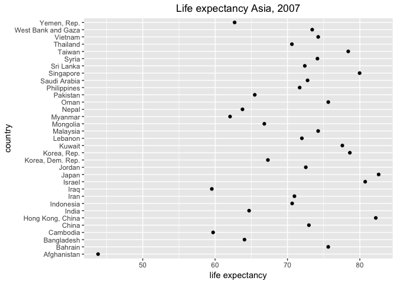

Although, visually not too bad, it kinda looks like a dart board with the person playing it having horrible precision and accuracy. Anyways, jokes aside, it is really unapppealing to quickly discriminate the life expectancies of each country from that plot.

This is where we would should apply the `forcats` package to reorder the levels in country. I have never used it before, so the cheat sheet is below.

Usage `fct_reorder`
-------------------

fct\_reorder(.f, .x, .fun = median, ..., .desc = FALSE)

Arguments

.f - A factor (or character vector).
.x, .y - The levels of f are reordered so that the values of .fun(.x) (for fct\_reorder()) and fun(.x, .y) (for fct\_reorder2()) are in ascending order.
.fun - n summary function. It should take one vector for fct\_reorder, and two vectors for fct\_reorder2.
... - Other arguments passed on to .fun. A common argument is na.rm = TRUE.
.desc - Order in descending order? Note the default is different between fct\_reorder and fct\_reorder2, in order to match the default ordering of factors in the legend.

Use the `forcats` packaage to reorder the factor levels. The default argument in the `fct_reorder()` is median, we are goung to order it based on mean life expectancy, again because we are cool .. nvm you get it ....

``` r
gapminderAsia2007 %>% 
  mutate(country = fct_reorder(country, lifeExp, .fun = mean)) %>% # reorder country by life expectancy
  ggplot() + 
  aes(lifeExp, country) + 
  geom_point() +
  ggtitle("Life expectancy Asia 2007") + # Title plot
  theme(plot.title = element_text(hjust = 0.5)) + # centers title
  xlab("Mean life expectancy") # x Axis label
```


It is much more discernible now for a quick glace. "Japan" and "Afghanistan" are at the highest and lowest respectively for the mean age in Asia as of 2007. I am from Malaysia so I always end up looking for Malaysia, we sits at around 11th from the top, not too bad ill loive long enough to say "because we are cool like that :D". Lets try flipping the order around by using the `.desc = TRUE` argument (see cheat sheet if needed)

``` r
gapminderAsia2007 %>% 
  mutate(country = fct_reorder(country, lifeExp, .fun = mean, .desc = TRUE)) %>% # defaukt .desc is FALSE, use TRUE for decending
  ggplot() + 
  aes(lifeExp, country, size = gdpPercap) + # added size = gdp, just to spice the plot a litte
  geom_point() +
  ggtitle("Life expectancy Asia decending 2007") + # Title plot
  theme(plot.title = element_text(hjust = 0.5)) + # centers title
  xlab("Mean life expectancy") # x Axis label
```


Recapping back to previous homework, there is a corelation between GDP per capita and life expectancy. The similiar trend is observed here.

#### look if at the dataframe if the factors aree re-ordered.

``` r
gapminderAsia2007 %>%  
   mutate(country = fct_reorder(country, lifeExp, .fun = mean, .desc = TRUE)) %>%
   head() 
```

    ## # A tibble: 6 x 6
    ##   country          continent  year lifeExp        pop gdpPercap
    ##   <fct>            <fct>     <int>   <dbl>      <int>     <dbl>
    ## 1 Afghanistan      Asia       2007    43.8   31889923      975.
    ## 2 Bahrain          Asia       2007    75.6     708573    29796.
    ## 3 Bangladesh       Asia       2007    64.1  150448339     1391.
    ## 4 Cambodia         Asia       2007    59.7   14131858     1714.
    ## 5 China            Asia       2007    73.0 1318683096     4959.
    ## 6 Hong Kong, China Asia       2007    82.2    6980412    39725.

``` r
 gapminderAsia2007 %>%  
   mutate(country = fct_reorder(country, lifeExp, .fun = mean, .desc = TRUE)) %>%
   arrange(country) %>%
   head()
```

    ## # A tibble: 6 x 6
    ##   country          continent  year lifeExp       pop gdpPercap
    ##   <fct>            <fct>     <int>   <dbl>     <int>     <dbl>
    ## 1 Japan            Asia       2007    82.6 127467972    31656.
    ## 2 Hong Kong, China Asia       2007    82.2   6980412    39725.
    ## 3 Israel           Asia       2007    80.7   6426679    25523.
    ## 4 Singapore        Asia       2007    80.0   4553009    47143.
    ## 5 Korea, Rep.      Asia       2007    78.6  49044790    23348.
    ## 6 Taiwan           Asia       2007    78.4  23174294    28718.

The table seems to be unchanged, in the sense that the countries still seemed to be ordered alphabetically order and via life Expectancy even after re-ordering. Lets give it a little push with the `arrange` function.

Applying the `arrange` function seems to have reordered the table in comparision to the plots above. It is not shown here for the sake of not repeating the same figues, assigning the `arrange()` like the chunk code below does not change the plot after refactoring. So the plot does seem to be ordered on mean life expectancies.

``` r
gapminderAsia2007 %>% 
  mutate(country = fct_reorder(country, lifeExp, .fun = mean, .desc = TRUE)) %>%
  arrange (country) %>% # LOOK HERE!!
  ggplot() + 
  aes(lifeExp, country, size = gdpPercap) + 
  geom_point() +
  ggtitle("Life expectancy Asia decending 2007") + # Title plot
  theme(plot.title = element_text(hjust = 0.5)) + # centers title
  xlab("Mean life expectancy") # x Axis label
```

#### Top 5 mean life expectancies

Take the top 5 mean life expectancies from table

``` r
# list of top 15 countries life expectancy, from the gapminderAsia2007 dataset. Use to subset gapminder, use comments above if unsure.

AsiaWalkingdead2007 <- gapminderAsia2007 %>%  
   mutate(country = fct_reorder(country, lifeExp, .fun = mean, .desc = TRUE)) %>%
  arrange(country) %>%
  top_n(5, lifeExp) %>%  # only pick top 5 countries 
  pull(country) # only outputs the top five country strings 

gapminderAsiaT5WD <- gapminder %>%  # df of just the 5 countries
  filter(country %in% AsiaWalkingdead2007) %>% # filter gapminder datase based on top 5 countries 
  droplevels() # drop unused levels

head(gapminderAsiaT5WD) # view the top six rows of our subset of the gapminder data frame
```

    ## # A tibble: 6 x 6
    ##   country          continent  year lifeExp     pop gdpPercap
    ##   <fct>            <fct>     <int>   <dbl>   <int>     <dbl>
    ## 1 Hong Kong, China Asia       1952    61.0 2125900     3054.
    ## 2 Hong Kong, China Asia       1957    64.8 2736300     3629.
    ## 3 Hong Kong, China Asia       1962    67.6 3305200     4693.
    ## 4 Hong Kong, China Asia       1967    70   3722800     6198.
    ## 5 Hong Kong, China Asia       1972    72   4115700     8316.
    ## 6 Hong Kong, China Asia       1977    73.6 4583700    11186.

``` r
gapminderAsiaT5WD %>% 
  ggplot() +
    aes(year, lifeExp) + # plot of life expectancy over time for those 5 countries
  geom_line(aes(group = country, colour = country)) + 
  ggtitle("Life expectancy over time for the top 5 Asian Countries in 2007") +
  theme(plot.title = element_text(hjust = 0.5)) + 
  xlab("life expectancy")
```

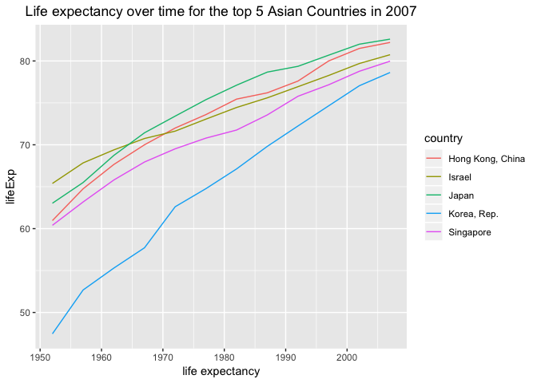

``` r
# assign for later use below, same as above 
p3 <- gapminderAsiaT5WD %>% 
  ggplot() +
    aes(year, lifeExp) +
  geom_line(aes(group = country, colour = country)) + # plot of life expectancy over time for those 5 countries
  xlab("life expectancy")
```

`fct_reorder2(.f, .x, .y)` reorders factor `.f`, country. The `.x` takes the maximum year and its accompaniying `.y` value which is life expectancy and reorders the `factor` variable country's levels accordingly.

``` r
 # Reorders the five Asian countries based on life expectancy.
gapminderAsiaT5WD %>% 
  mutate(country = fct_reorder2(country, year, lifeExp)) %>% 
  ggplot() +
  aes(year, lifeExp) +
  geom_line(aes(group = country, colour = country)) + # plot of life expectancy over time for those 5 countries
  ggtitle("Life expectancy over time for the top 10 Asian Countries in 2007") + # add title
  theme(plot.title = element_text(hjust = 0.5)) + # centers title
  xlab("life expectancy")
```

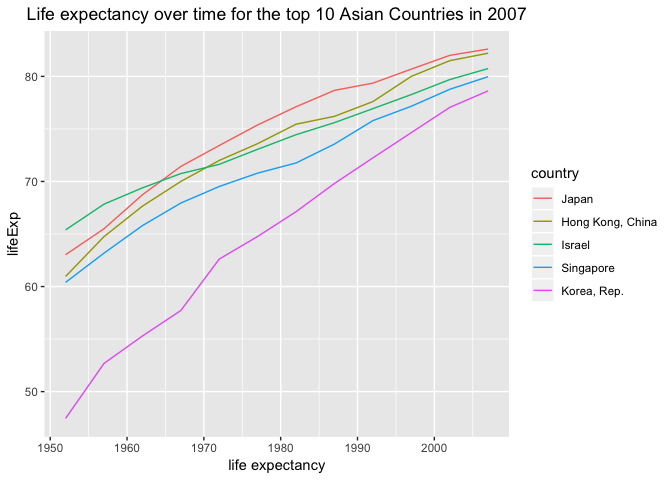

``` r
# same plot as above, for side by side comparision
p4 <- gapminderAsiaT5WD %>% 
  mutate(country = fct_reorder2(country, year, lifeExp)) %>% 
  ggplot() +
  aes(year, lifeExp) +
  geom_line(aes(group = country, colour = country)) + # plot of life expectancy over time for those 5 countries
  xlab("life expectancy")

grid.arrange(p3, p4, # makes a grid of plots so multiple plots can be dislpayed
  nrow = 2, # a plot in a 2 column 1 row format 
  top = "Before factor vs after factor", # tittle for the grid plots
  widths = c(0.4, 0.4), # width for the plots
  clip = FALSE)
```

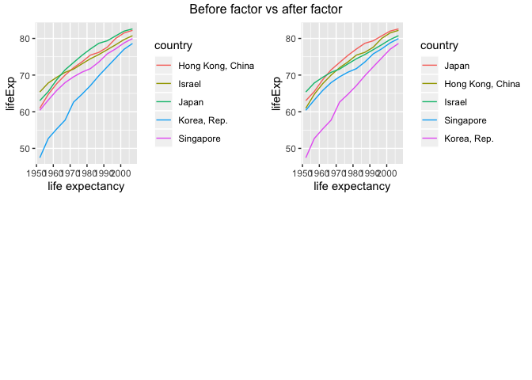

The reordered plot matches the scatter plot we made at the start where Japan was at the top followed by hong kong, this reassures that the the refactor is based on the life expectancy which does correspond to the earlier dataset of Asia's mean life expectancies in 2007. The two plots side by side shows that when reordereed the countried do change position based on the criteria of evaluation, where the before stands for ordered alphabetically.

#### five countries with the highest life expectancy in 2007.

Lets repeat the arrange feat we did in the above section again to see if we end at up at the same plot using the subseted gamminder dataset.

``` r
gapminderAsia2007T5 <- gapminderAsiaT5WD %>%  
  filter(year %in% 2007) # 5 asian countries with the top life expectancy in the year 2007

gapminderAsia2007T5 
```

    ## # A tibble: 5 x 6
    ##   country          continent  year lifeExp       pop gdpPercap
    ##   <fct>            <fct>     <int>   <dbl>     <int>     <dbl>
    ## 1 Hong Kong, China Asia       2007    82.2   6980412    39725.
    ## 2 Israel           Asia       2007    80.7   6426679    25523.
    ## 3 Japan            Asia       2007    82.6 127467972    31656.
    ## 4 Korea, Rep.      Asia       2007    78.6  49044790    23348.
    ## 5 Singapore        Asia       2007    80.0   4553009    47143.

``` r
gapminderAsia2007T5ReOrd <- within(gapminderAsia2007T5, country <- country <- reorder(country, lifeExp, .fun = mean)) # Evaluate reordeing country based on mean life expectancy, within the gapminderAsia2007T5 dataset

gapminderAsia2007T5ReOrd  # See if the order is changed, then look at the levels to make sure
```

    ## # A tibble: 5 x 6
    ##   country          continent  year lifeExp       pop gdpPercap
    ##   <fct>            <fct>     <int>   <dbl>     <int>     <dbl>
    ## 1 Hong Kong, China Asia       2007    82.2   6980412    39725.
    ## 2 Israel           Asia       2007    80.7   6426679    25523.
    ## 3 Japan            Asia       2007    82.6 127467972    31656.
    ## 4 Korea, Rep.      Asia       2007    78.6  49044790    23348.
    ## 5 Singapore        Asia       2007    80.0   4553009    47143.

``` r
levels(gapminderAsia2007T5ReOrd$country) # look at the levels in the mini dataset
```

    ## [1] "Korea, Rep."      "Singapore"        "Israel"          
    ## [4] "Hong Kong, China" "Japan"

They look the same like the first ordered tables where the levels have not changed, but they are displayed in the order increasing life expectancies. Lets plot them to be sure.

``` r
gapminderAsia2007T5ReOrd %>% # look above for comments
  ggplot(aes(lifeExp, country)) +
  geom_point() +
  ggtitle("Top 5 Life expectancy of Asian countries in 2007") # title
```

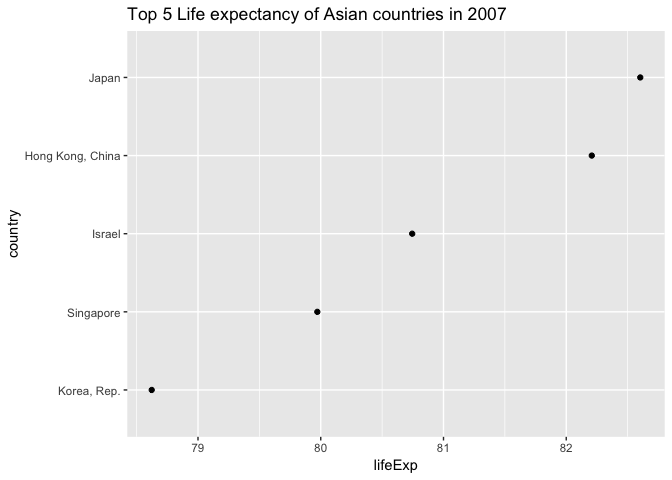

``` r
# See if the old list matches the new list.

 gapminderAsia2007 %>%  
   mutate(country = fct_reorder(country, lifeExp, .fun = mean, .desc = TRUE)) %>%
   arrange(country) %>%
   pull(country) %>% head(5) %in%  levels(gapminderAsia2007T5$country)
```

    ## [1] TRUE TRUE TRUE TRUE TRUE

The old list matches the new list. The new subset plot matches the old.

End of the tedious sanity check.

Part 2: File I/O
================

Lets do a simple `write.csv` on the data we have just worked on and re-rodered..

### `write.csv` and `read.csv`

``` r
# Write gap_select_2007.csv 
write.csv(gapminderAsia2007T5ReOrd, "gapminderAsia2007T5.csv") 

# Read in gap_select_2007T5.csv and assign into differnt variable to check
gapminderAsia2007T5ReOrd2 <- read.csv("gapminderAsia2007T5.csv") 

# compare write and read file before and after, but it throws a warning that the dimensions dont match
# gapminderAsia2007T5ReOrd2 == gapminderAsia2007T5ReOrd 

# Check dimension
dim (gapminderAsia2007T5ReOrd2) - dim(gapminderAsia2007T5ReOrd) # To check if there is an extra dimension.
```

    ## [1] 0 1

``` r
names(gapminderAsia2007T5ReOrd) # name all variable
```

    ## [1] "country"   "continent" "year"      "lifeExp"   "pop"       "gdpPercap"

By looking at the `write.csv` dimension we can see it produces an extra variable in the new file. It looks like it added a row name in the first position of the dataframe that was initially just numbers. A forum in stack over flow [here](https://stackoverflow.com/questions/10441437/why-am-i-getting-x-in-my-column-names-when-reading-a-data-frame) has discussed this issue in detail. The `read.csv()` is a wrapper around the more general `read.table()` function". The behavior of adding a new column with an `X` header is consistent with the behaviour of the read.table() function. Use `row.names = FALSE` to the write.csv() function to override that behaviour of adding an extra column for the first emply column.

``` r
# Write .csv 
write.csv(gapminderAsia2007T5ReOrd, file = "gapminderAsia2007T5ReOrd.csv", row.names=FALSE) 

# Read .csv 
gapminderAsia2007T5ReOrd2 <- read.csv("gapminderAsia2007T5ReOrd.csv") 

# matches the second data frame with the first dataframe and produces true for every value, TRUE is only returned if every is true when used with any()

all(gapminderAsia2007T5ReOrd2 == gapminderAsia2007T5ReOrd) 
```

    ## [1] TRUE

Looks like we have fixed it. To summarize, we have sucessfully created imported, rearraged, created an ordered catogorical (life expectencies by country) dataframe, wrote it onto a `.csv` and read them sucesfully without breaking anything.

Next, I will look at the when the rows are in ascending order of life expectancy in 2007. In particular, we should look to see if the rows are still arranged in order of ascending life expectancy when we read in the CSV.

``` r
# Write .csv
write.csv(gapminderAsia2007T5ReOrd, file = "gapminderAsia2007T5.csv", row.names=FALSE) 

# Read .csv
gapminderAsia2007T5ReOrd2 <- read.csv("gapminderAsia2007T5.csv") 


# let's see what we got when we read in the CSV and see if they match with the ordered set
levels(gapminderAsia2007T5ReOrd2$country) == levels(gapminderAsia2007T5ReOrd$country)
```

    ## [1] FALSE FALSE FALSE FALSE FALSE

Something is not quite right here, plot to make sure and check these orders again.

``` r
p5 <- gapminderAsia2007T5ReOrd %>% # look above for comments
  ggplot(aes(lifeExp, country)) + 
  geom_point()

p6 <- gapminderAsia2007T5ReOrd2 %>% # look above for comments
  ggplot(aes(lifeExp, country)) + 
  geom_point()
 
grid.arrange(p5, p6,  # makes a grid of plots so multiple plots can be dislpayed
  nrow = 2, # a plot in a 2 column 1 row format 
  top = "Before write.csv vs after write.csv", # tittle for the grid plots
  widths = c(0.4, 0.4), # width for the plots
  clip = FALSE)
```

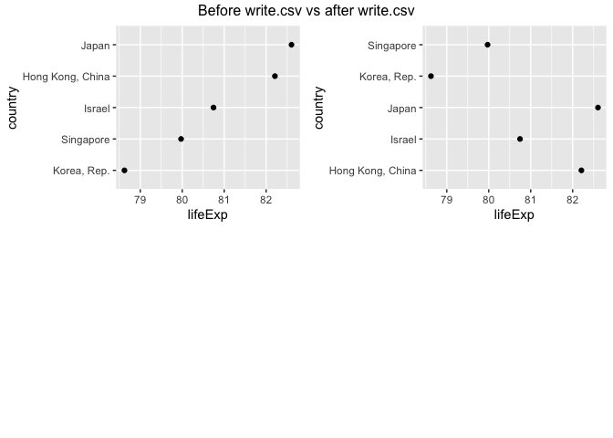

It seems when we do a `read.csv`, it refactors the dataset according to alphabetical order, which is good to know and preety darn sneaky by `read.csv`. Order is lost on import and it defaults to order by alphabetical order on imports according to [here](https://stackoverflow.com/questions/42453098/order-levels-of-factors-change-after-write-csv-and-read-csv-in-r?rq=1)

Part 3: Visualization design
============================

I wonder how was Malaysia doing during the mass genocide in Rwanda and Cambodia. Lets look at the trend of life expectancy with a year slide. We will use gganimate to show the trend along the years when the mass genicide happened in Rwanda and Camboadia. We will subset namely three countries from the dataset Cambodia, Malaysia and Rwanda. Since all the other colums are not needed and it slows the plot, we willl just select three column to reduce the load on the cpu so things would run s little bit faster (yes just a tiny little).

**According to wikipedia**

> The Rwandan genocide, also known as the genocide against the Tutsi, was a mass slaughter of Tutsi in Rwanda during the Rwandan Civil War, which had started in 1990. It was directed by members of the Hutu majority government during the 100-day period from 7 April to mid-July 1994. An estimated 500,000 to 1,000,000 Rwandans were killed, constituting an estimated 70% of the Tutsi population.

> The Cambodian genocide was carried out by the Khmer Rouge regime under the leadership of Pol Pot, killing approximately 1.5 to 3 million Cambodian people from 1975 to 1979. The Khmer Rouge wanted to turn the country into a socialist agrarian republic, founded on the policies of Maoism.

keep an eye out for the population drop in 1977 in Camboadia and 1992 in Rwanda. I was just 7 years old in 1992 !!.

#### `gganimate`

``` r
gapminderGenocide <- gapminder %>% 
  select(country, year, lifeExp) %>% # only select country, year, and gdpPercap columns
  filter((country == "Cambodia" | country == "Rwanda" | country == "Malaysia")) %>%
  group_by(country, year) %>% # group by country and year # add mean gdpPercap columnr
  ggplot(aes(x =  year, y = lifeExp, color = country, group = country)) +
  geom_path(size = 2, alpha = 0.4, arrow = arrow()) + # lines of the mean gdpPercap of the 3 countries over the years
  # gganimate code parts are below 
  transition_reveal(year, year) # transitions are the years

gapminderGenocide # let's see the animation!
```

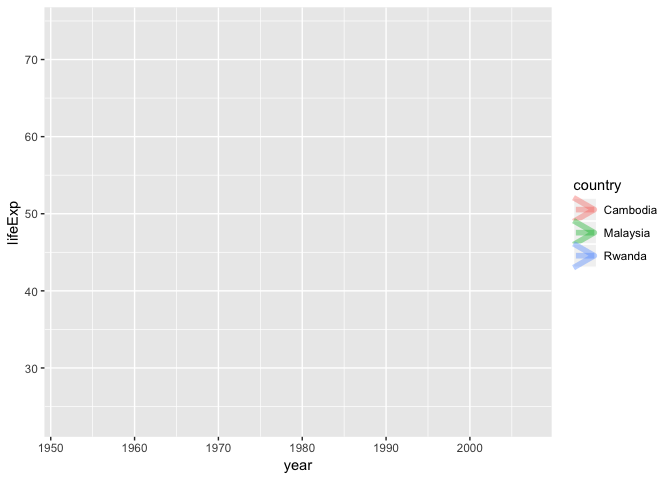

If you would have watched Hans Roslings TED talk on the gapminder dataset, you would hear his argument that Asia is becoming the next powerhouse and they have caught up with Europe in terms of GDP per capita and life expectancy. He uses a time slider and commentary based approach when the time slider runs, kinda like watching soccer in the 80's and 90s. Watch it if you havent. Now lets see if we can simulate the same effect with displaying GDP percapita and population instead using some tips from this site [here](https://github.com/thomasp85/gganimate) and making a new column from an external dataset which has mean years in school for countries around the world.

``` r
# Import datazet, this dataset only has the country and mean years in school from 1972 to 2007
gapminder_school_filtered <- read.csv("https://query.data.world/s/bpbbjyj7t6k2u6owizb7tr4fm4h4fq", header = TRUE, check.names = FALSE) %>% 
  rename(country = "Row Labels") %>%  # renames the row label column to country
  filter(country %in% gapminder$country) # filter the country with the gapminder dataset

## filter countries list that are in both gapminder and gapminder school dataset and store into cntry
cntry <- unique(gapminder$country)[unique(gapminder$country) %in% # %in% same as match()
                                 gapminder_school_filtered$country] # This returns a logical vector. It is then used to subsets the gapminder country dataset 

## subsets the gapminder dataset for merging them later
gpmd_cont <- gapminder %>% 
  filter(country %in% cntry) %>% 
  subset(!duplicated(country)) %>% 
  select("country","continent")

gapminder_tidyschool<- gapminder_school_filtered %>% 
  select("country",as.character(unique(gapminder$year)[-c(1:4)])) %>% # selects the first column and the years present from the gapminder dataset.
  mutate(continent = gpmd_cont$continent) %>% # add continent to gapminder school
  gather(year, meanSchool, -c("country", "continent")) # changes the data to tidy

gapminder_tidyschool$year <- as.integer(gapminder_tidyschool$year) # change year to integer
gapminder2 <- inner_join(gapminder, gapminder_tidyschool) # join with gapminder dataset for new dataset
  
  
 gapminder2ganimplot <- gapminder2 %>% # use new dataset for gganimate
  ggplot() +
    aes(gdpPercap, meanSchool, size = pop, colour = country) +
    geom_point(alpha = 0.8, show.legend = FALSE) +
    scale_colour_manual(values = country_colors) +
    scale_size(range = c(2, 12)) +
    scale_x_log10() +
    facet_wrap(~continent) 
 
 gapminder2ganimplot +
# The parts that make gganimation works.
    labs(title = 'Year: {frame_time}', x = 'GDP per capita', y = 'mean years in school 25 - 34 years old') +
    transition_time(year) +
    ease_aes('linear')
```

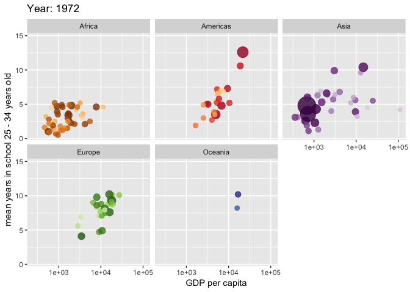

This plot shows the effect of GDP per capita on the mean years in school from age 25 till 34. There is an interesting drop of GDP per capita in one of the country in the Asian region at around the year

### plotly plots

We can also make the same plot using plotly

``` r
ggplotly_gapminder2 <- ggplotly(gapminder2ganimplot) # ggplotly of new gapminder dataset

htmlwidgets::saveWidget(ggplotly_gapminder2, file = "ggplotly_gapminder2.html")
```

The actual plotly is [here](https://rawcdn.githack.com/STAT545-UBC-students/hw05-zeeva85/master/ggplotly_gapminder2.html)

The plotly plots are pretty interactive, you hover on them to get more on the observations and variables, use the site above to chech it out if you are cool enough.

Part 4: Writing figures to file
===============================

### `ggsave()` the day

using the `ggsave` function to save a plot to on to a file. Following that, we can map it using the `` to load and embed that figure on reports.

``` r
map <- map_data('world') 
 # world map coordinates stored in "maps" variable. Use install.packages (maps)

gapminder2 %>% 
  group_by(country) %>% # group by country
  ggplot(aes(fill = meanSchool), alpha = 0.2) + # fill = frequency of country in list
  geom_map(aes(map_id = country), map = map) + # calls geom_map function with map id = country and, map for cordinates
  expand_limits(x = map$long, y = map$lat) + # longitude and latitude list information provides the limits for the plot area
    ggtitle("Mean school years from 24 - 35")
```


``` r
ggsave("meanschoolyears24-35worldmap.png", scale = 2.1) # save the plot using 
```

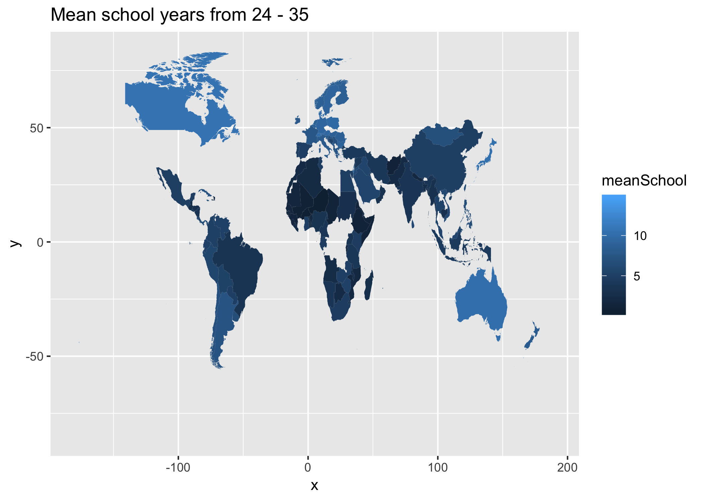

Try playing around with the width, height, units and dpi to get different output sizes onto the report.

``` r
ggsave("meanschoolyears24-35worldmap2.png", width = 7, height = 7, units = "in", dpi = 400) # edit me to change size
```

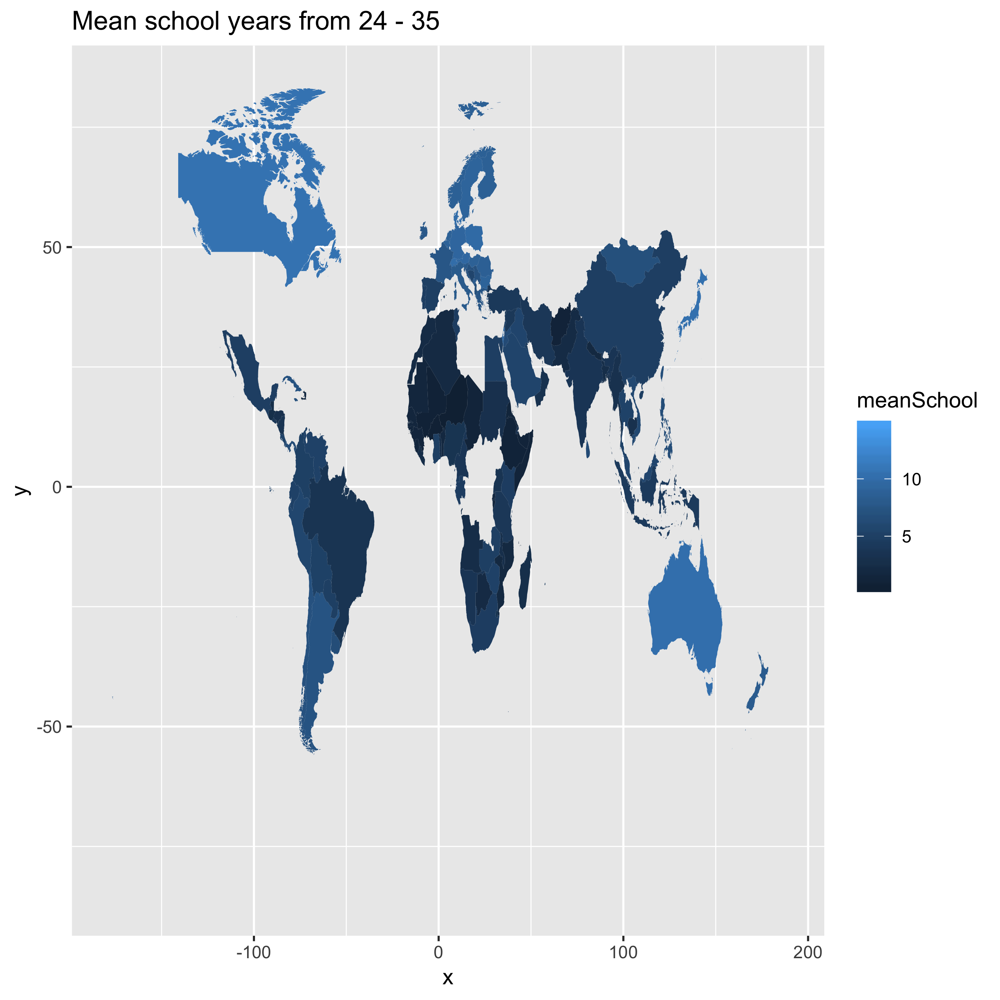

You can see how the plots have rather changed in size a little. The dpi argument changes the resolution of the plot [ggplot2 reference](https://ggplot2.tidyverse.org/reference/ggsave.html).

raster output ??? vector output??? Read the [source](https://designshack.net/articles/layouts/vector-vs-raster-what-do-i-use/) to find out more.

In a nutshell 2 types of digital graphics files – vector and raster.

Raster images are often called bitmap images because they are made of millions of tiny squares, called pixels. \* -jpg, gif, png, and tif.

-   Raster images are composed of pixels. But how do you know what format is best for your next project?

Vector images, which are made of thin lines and curves known as paths, are rooted in mathematical theory. Vectors are in terms of lines and nodes. Vectors are such that they look smooth when you zoom in. \* - PDF, SVG, and postscript. \* - Text is one of the most common types of vector image.

-   Vector images are made of hundreds of thousands of tiny lines and curves (or paths) to create an image.

``` r
ggsave("meanschoolyears24-35worldmap.png", dpi = "print") # save in print to get high DPI.
```

like this-:


Since we've talked some about rasters, we can move on and talk a little about vectors. Again, I am referring to [here](https://designshack.net/articles/layouts/vector-vs-raster-what-do-i-use/)

But I want to do more
=====================

But I have done more, I have combined them above using the gapinder dataset. See below, made an entire new dataset `gapminder2`, associated mean years in school for the age 24 - 35 for 133 countrie. Combined that dataset with the existing gapminder dataset and used gganimate to display the trend throught the years.

``` r
gapminder_school_filtered <- read.csv("https://query.data.world/s/bpbbjyj7t6k2u6owizb7tr4fm4h4fq", header = TRUE, check.names = FALSE) %>% 
  rename(country = "Row Labels") %>% 
  filter(country %in% gapminder$country)]

cntry <- unique(gapminder$country)[unique(gapminder$country) %in%
                                 gapminder_school_filtered$country] 
gpmd_cont <- gapminder %>% 
  filter(country %in% cntry) %>% 
  subset(!duplicated(country)) %>% 
  select("country","continent")

gapminder_tidyschool<- gapminder_school_filtered %>% 
  select("country",as.character(unique(gapminder$year)[-c(1:4)])) %>%
  mutate(continent = gpmd_cont$continent) %>% 
  gather(year, meanSchool, -c("country", "continent")) 

gapminder_tidyschool$year <- as.integer(gapminder_tidyschool$year) 
gapminder2 <- inner_join(gapminder, gapminder_tidyschool) 
  
  
 gapminder2ganimplot <- gapminder2 %>%
  ggplot() +
    aes(gdpPercap, meanSchool, size = pop, colour = country) +
    geom_point(alpha = 0.8, show.legend = FALSE) +
    scale_colour_manual(values = country_colors) +
    scale_size(range = c(2, 12)) +
    scale_x_log10() +
    facet_wrap(~continent) 
 
 gapminder2ganimplot +
    labs(title = 'Year: {frame_time}', x = 'GDP per capita', y = 'mean years in school 25 - 34 years old') +
    transition_time(year) +
    ease_aes('linear')
```
